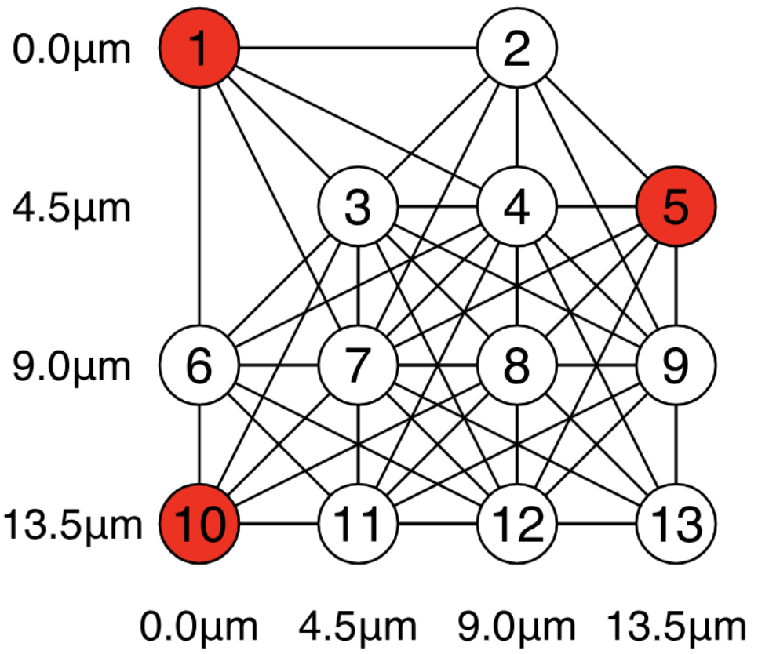
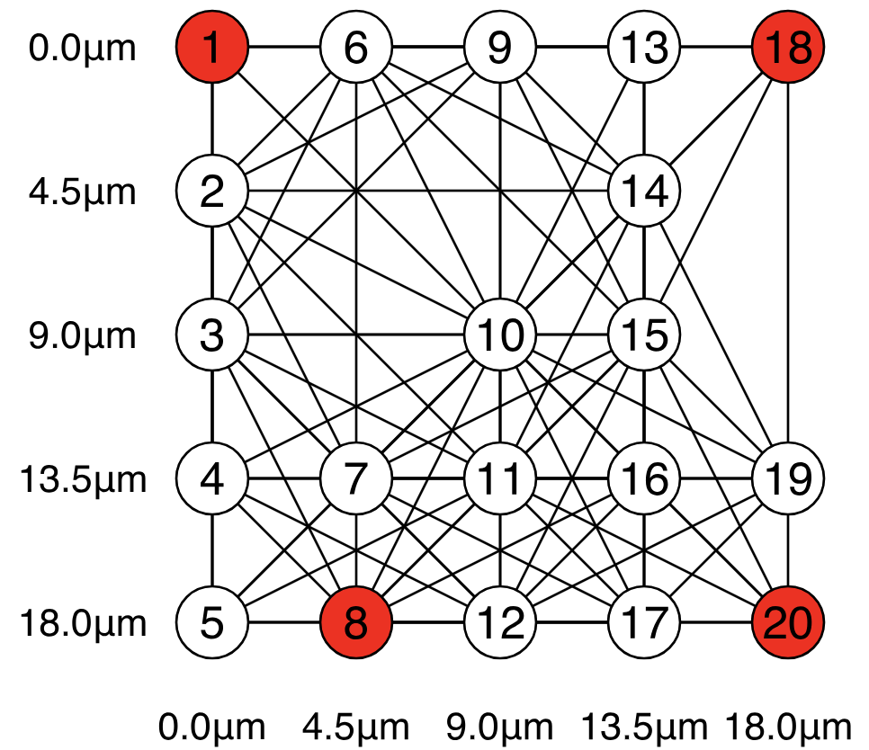
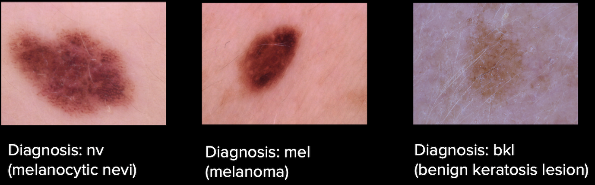
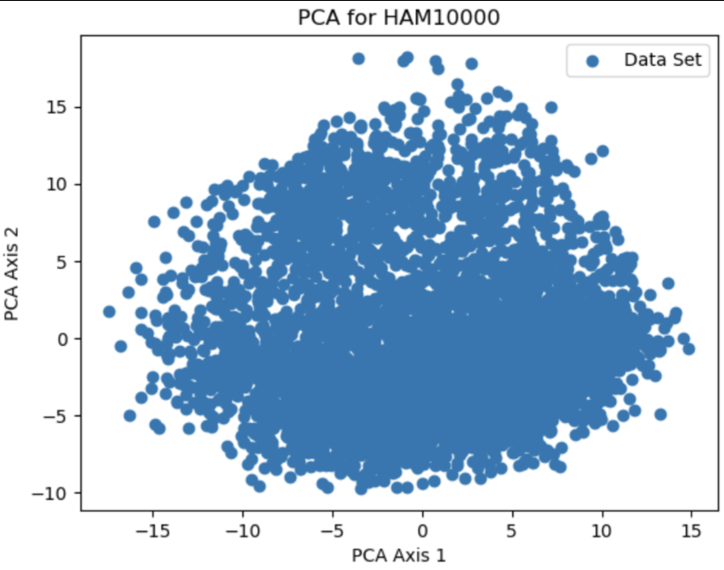

# quera-mis

## Activities:

### Theory
*	Determine the parameters of a quantum algorithm for a neutral atom quantum computer to solve MIS with a unit-disk radius for connectivity larger than king’s.

A unit disk larger than King's implies modification to the Rb/a value, indicating the radius of the "disk" used to determine the connectivity between vertices. The specific machine, in this case Aquila, utilizes the rydberg_h class from bloqade, which is described as "Create a rydberg program with uniform detuning, amplitude, and phase". We create our variables delta and omega, reperesenting detuning and amplitude respectively, combined with the graph coordinates, it can be run by the Aquila machine for solving IS/MIS problems. The delta value, precisely, is calculated based on the C6/Rb^6 variable, which determines the upper and lower bound. 

### Programming
* Perform simulations using [Bloqade](https://queracomputing.github.io/Bloqade.jl/dev/) on the largest possible system sizes you can. Optimize your protocol to maximize chance of measuring an MIS (optimization methods include [Nelder-Mead](https://queracomputing.github.io/Bloqade.jl/dev/tutorials/5.MIS/main/), [Bayesian methods](https://arxiv.org/pdf/2305.13365.pdf), counter-diabatic methods, or more)
    + Demonstrating higher probability of measuring MIS => more points!
    + Being able to simulate larger systems => more points!

    As we started performing simulations, we quickly realised that scaling up the grid by even one more node per row and column would result in straining the capabilities for simulation on our hardware. We know that each qubit doubles the RAM requirement because qubit memory requirement scales up by 2^N. We found that 4x4 lattices wouldn't cross that computational threshold, but some 5x5 lattices did and certainly could not get any 6x6 to work. Varying the complexity from Rb/a = sqrt(2*sqrt(2)) to Rb/a ~ 3 also changes the computational intensity of simulation, as expected. 

    We implemented two major protocols to optimize measuring an MIS:
    1. The QAOA method: We found that this worked surprisingly well for more Rb/a ~ 3 cases. For example, the MIS was indentified correctly for the following graphs, and we also found that the optimization algorithm always had the MIS in the top 3 solutions.
    
    
    This meant that we just needed to implement some postprocessing (an attempt of which you can find in the QAOA_experimental notebook). However, we had some object type issues when trying to utilize the Bloqade MIS methods. The general idea of the method was to loop through the top 10 options that had highest probabilities, then eliminate those that don't classify as an independent set and then find the maximum suggested independent set in that top 10. omega, delta and the time evolution was tuned to do the QAOA method - where omega was kept largely constant (long pulses) and delta needed to be kept close to 0, this ensured that the phase accumulated over time and played an important factor to the Hamiltonian. 

    2. The Adiabatic method: For the adiabatic method, omega is set as the trapezoid shape, to keep area maximised under the curve. The variational optimization is for the delta function. The Nelder-Mead optimization is used to optimize for the shape of delta and also delta_max. It was slightly difficult to find initialized parameters that did not cause the optimization to fail (it would find it hard to minimize), and the proposed probability of getting and MSI seemed scarily low for some graphs.

    

*	Use [generic tensor networks](https://github.com/QuEraComputing/GenericTensorNetworks.jl), [Bloqade](https://queracomputing.github.io/Bloqade.jl/dev/), or your favorite method to estimate the (quantum and classical) annealing hardness parameters of the problem instances you found
    + Finding harder instances => more points!

We ran multiple jobs on the Aquila hardware using the Python package, starting with the 5x5 sample, Rb/a = 1, as shown in the challenge statement (5x5 king's lattice). With Rb/a = 1, we calculated the respective delta and omega as parameters for a piecewise linear function over time. The problem was slowly scaled up from 5x5 to the theoretical maximum of 16x16. Due to the limitation in the number of shots per job, the accuracy of MIS decreased as the dimension increased, requiring post-processing for the data. Due to exponential growth in combinations for IS/MIS as nodes increased, certain nodes exhibited the same amount of counts, which requires post-processing to be used to determine which node, if either, fits inside the MIS.

### Business
We riffed off the idea that if two training examples are identical, we don’t need to train on both of them. This leads to redundant information. Therefore, we would benefit from having less training examples as long as the ones we remove are repetitive. This would result in only a mild decrease in accuracy but a massive decrease in computational cost. 

We chose the example of 10,000 images of skin lesions and their diagnoses. There are 5 possible diagnoses including melanoma and benign keratosis legion. We chose this dataset because of how easy it is to get embeddings for images, although with time we can get almost any type of embedding. 

With these embeddings, we do Principal Component Analysis (PCA) to map the embedding vectors onto a 2-dimensional space. Points that are similar to each other will be close in the space. Then, we perform a transformation that takes the scatter to a lattice grid format. This is possible with multiple methods with various degrees of information loss. The method we explored was snapping onto the coordinate grid in a predefined way, but this loses data. The other method we could not explore due to resource constraints is a machine learning model that approximates the best grid spacing, angle of coordinates, and displacement from the origin. This is similar to the images from the following thread: (https://stackoverflow.com/questions/62946604/fitting-an-orthogonal-grid-to-noisy-coordinates). 

Once we snap the points onto a lattice grid, we run MIS on the resulting graph using a neutral atom quantum computer. This gives us the maximum amount of clusters of data such that each cluster is sufficiently unique. The points selected from this algorithm are the training data that we will use on our algorithm, rather than the whole dataset. 

Lastly, we train the model classically using a neural net, showing promising results and a clear improvement even after controlling for training size (we did this by showing that selecting some subset of random points is far worse than selecting the specific subset of points from MIS).

The one flaw of this algorithm is that the upfront cost of running the MIS is high, although this can be reduced by only running MIS on a handful of training examples at a time (so that we are running MIS 1000 times on 1000 training examples rather than 1 time on 1000000 examples). Since MIS is NP-hard and likely takes exponential time, it is beneficial to split the run of MIS into multiple iterations which also makes it easier to run on a quantum computer. With improvements in neutral atom quantum computers, we can use a quantum computer instead of a classical computer to run MIS and therefore speed up the ML training process.
